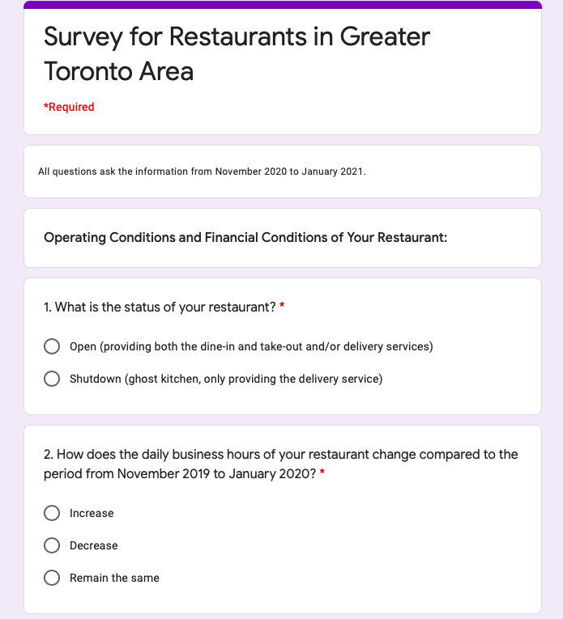

```{r set up, echo = FALSE, results = FALSE, message = FALSE, warning = FALSE}
### Preamble ###
# Purpose: explore the effect of COVID shut-downs on restaurants in Greater Toronto Area (GTA)
# Author: Jia Jia Ji
# Email: jiajia.ji@mail.utoronto.ca
# Date: Feb.24, 2021
# To do: simluate the data for control group and treatemnet group, make graphs to compare the responses from 2 groups
```


```{r set up and citation, echo = FALSE, results = FALSE, message = FALSE, warning = FALSE}
### install and load the packages ###
#install.packages('tidyverse')
#install.packages('ggplot2')
library(tidyverse)
library(ggplot2)

### R and R packages citations ###
citation()
citation('tidyverse')
citation('ggplot2')
```


# Introduction:

Since the Covid-19 pandemic outbreaks happen around the world, how to take effective measures to restrict its spread has been thrown into sharpe focus. Many countries put some serious regions under lockdown and shutdown some businesses. The City of Toronto has announced a series of public restrictions since March 2020, including the social distance requirement, school closure, remote working requirement, entertainment facilities restrictions, shut-downs on non-essential businesses and etc. Accompanying with these policies, many businesses struggle. The restaurant business is among the list, many restaurants close down during the pandemic because the owners cannot afford the expenses. Therefore, learning more about the effect of COVID shut-downs on restaurants is crucial for both the government and the restaurant businesses. Specifically, business owners can get familiar with the industry’s current situations, meanwhile, the government can understand how to take more targeted measures to reduce restaurants’ burden if some significant drawbacks of shut-downs exist.

This paper aimed to investigate the effect of COVID shut-downs on the restaurants in Greater Toronto Area (GTA). The sample was 1000 restaurants in Toronto. We performed a randomized controlled trial to randomly shut down some restaurants in Toronto while keep the others open. Accordingly, the intervention was the shut-downs on restaurants, the control group included these open restaurants, and the treatment group included the shutdown restaurants. Besides, we conducted an online survey to get responses about current situations from the sampled restaurants. The dataset was the simulated responses from the survey by releasing it to R [@Rcitation] and setting different parameters for these 2 groups. So, the main research question was to explore how these survey responses varied between the control group and treatment group. By addressing these differences, we can understand the effect on restaurants regarding some aspects caused by the shut-downs, and the government can be aware of these problems and make effective policies or give subsidies to the impacted restaurants. 

The remaining paper was organized into 2 sections. Firstly, in the Data section, we discussed the intervention of this experiment, along with the sampling methods and random allocation of treatment. We also explained the population, frame and sample of this experiment. Then, we talked about processing the non-responses and protecting the respondent privacy, as well as the data simulation methods. Besides, we made some plots to visualize the differences between the treatment and non-treatment groups based on the survey questions. Afterwards, in the Discussion section, we gave a brief overview of this paper and discussed the key findings. Also, we talked about main limitations and future improvements of this paper regarding the survey methodology, survey design, data gathering methods and ethical issues.


# Data:   

We used `R` [@Rcitation], the `tidyverse` package [@citetidyverse], and the `ggplot2` package [@citeggplot2] to analyze data and make plots. The restaurant outlook survey report for the second quarter 2020 published by Restaurants Canada [@citeliterature1] provided information about parameterizing the data simulations.


**2.1 Intervention:**

We aimed to perform a Randomized Controlled Trial (RCT) to test the effect of COVID shut-downs on restaurant businesses. Obviously, we used the shut-downs on some restaurants as the intervention to generate 2 separate groups: a control group and a treatment group. Specifically, the restaurants in control group were allowed to remain open providing the dine-in and take-out/delivery services, while the restaurants in treatment group were shut down mandatorily and were only allowed to do the ghost kitchen (which provided the delivery service only). We consider all the restaurants in Greater Toronto Area (GTA) as the frame of this experiment. To take a random sample of 1000 restaurants within the frame, we used Stratified Random Sampling method to divide all restaurants into multiple strata (homogeneous subgroups) based on the street blocks, then we randomly sampled some restaurants within each stratum using Simple Random Sampling. The number of restaurants sampled in each stratum was proportional to the number of restaurants in this subgroup compared to the number of restaurants in Toronto. We used this random sampling method, because the restaurants in Toronto were heterogenous in general, also the street block was a reasonable basis for forming the subgroups. This method removed the bias due to geographic differences, so that we had a more representative sample to better cover the entire population and improve the precision and generalization of results. Besides, since all frame units were equally likely to be sampled, the randomness was ensured, and there was no selection bias such as selecting some specific restaurants for convenience. So, this random sample ensured the external validity, which indicated that the findings gotten from this sample could be appropriately generalized to a larger population. More importantly, this experiment could perform well with a smaller sample size, so the government could spend less money to achieve the goal. However, the stratified sampling method may be more complicated and need more effort to be performed, so this was a trade-off of this method.   

Afterwards, in terms of the allocation of treatment, we used the R-based [@Rcitation] random number generator to ensure the random assignment of restaurants to the control group and treatment group. For each stratum, we counted the number of sampled restaurants (assume N) and gave each restaurant a unique number between 1 and N (both included). Then, we sampled N binary numbers (i.e. 0 or 1) with an equal probability in R [@Rcitation], where the index of each binary number corresponded to the unique number given to the restaurant. The restaurants that got 0 were assigned to the control group, and the others were assigned to the treatment group. Meanwhile, we saved the sampling code and recorded this random assignment result in a spreadsheet, and we could make it public after the experiment was completed. This random allocation of treatment avoided the counterfeit counterfactual estimate and selection bias caused by the self-selection of restaurants [@citeliterature2], because restaurants that were poorly operated tended to be shut down and assign themselves to the treatment group. Moreover, these 2 randomized processes  (i.e. the random sampling process and the random allocation of treatment), along with the relatively large sample size (1000), ensured that the sampled restaurants shared similar observed and unobserved characteristics [@citeliterature2]. Accordingly, holding all other factors invariant, the control group and treatment group only differed in the treatment (which was the shut-downs on restaurants), and this ensured the internal validity. So, we could compare these 2 groups to know the effect on restaurants caused by the shut-downs. 

All the sampled restaurants were required to follow the Ontario government rules about shutting down some restaurants, and their activities were monitored by the government department and Petit Poll. In other words, the restaurants in control group could not arbitrarily close their businesses, and the restaurants in treatment group could not re-open the door and provide the services except delivery. This randomized controlled trial ran for 2 months, from November to December 2020.


**2.2 Survey Methodology:** 

We decided to conduct an online survey to collect information about restaurants’ current situations during the pandemic for both the control group and treatment group. The population of this experiment was all restaurants in Ontario, the frame was all restaurants in Greater Toronto Area, and the sample was those 1000 restaurant in Toronto sampled using stratified random sampling method, which was discussed in detail in section 2.1.

We considered these 1000 sampled restaurants as the actual participants in this experiment, and to reach these desired respondents, we mailed each of them a letter specifying this survey’s  motivation, purpose and respondent privacy protection to invite them to participate in the survey. To make the respondents complete the survey more conveniently, we included both the URL link and QR code in the letter, and respondents could fill in the survey in either way. 

The survey was conducted online to save more printing expenses. All respondents had the same URL link and QR code, but their responses were only visible to the data collectors. Also, the survey was anonymous, and each restaurant was only allowed to submit the completed survey once. 

Non-responses may exist in this survey, because some restaurants that were only slightly affected by the pandemic tended to ignore the survey. In other words, we might oversample the restaurants that had strong opinions on the effect of pandemic on businesses, which could cause the selection bias. Also, the different numbers of non-responses in the control and treatment groups may make the data biased and would over-estimate or under-estimate the impacts. Therefore, to lower the non-response rate, we emphasized the significance of the survey for the development of restaurant industry and for the government to support the businesses better. Besides, Petit Poll prepared some gift cards for the respondents (each of them would have an equal chance to win), which may attract more desired respondents to answer the survey. 

Since all responses were anonymous and were hidden to all the others except the experimenters, the responses could not be shared among respondents. Moreover, there was no sensitive personal question, such as the location and revenue of the restaurant, in the survey. The Ontario government department and Petit Poll would not make any private information of the respondents public.  

In terms of the costs, the Ontario government department was responsible for the paper, printing and postal expenses, which were estimated to be \$1500 in total. Meanwhile, Petit Poll would spend approximately \$2000 on gift cards, data collection process and data analysis. 


**2.3 Survey:**

The survey ^[The URL link of the survey: https://forms.gle/Tgt5AkLPUP3UNVm16.] aimed to collect information about the business management, financial conditions and the opinions of each restaurant’s owners on the impacts of pandemic on businesses, then compare the differences of the data in control group and treatment group to explore the effect of shut-downs on businesses regarding these aspects. There were 10 questions in the survey, including 1 simple attention check question in the middle to ensure the reliability of responses. All questions in this survey were required to answer. The first part contained questions about the changes in operating conditions (regarding the open/shutdown status, daily business hours and number of employees) and financial positions (regarding monthly sales change and profitability) of each restaurant. The second part was to ask whether each restaurant had received COVID-related government subsidies, as well as its satisfaction on these subsidies. Then, the last part was to ask the opinions on the impacts of pandemic on the restaurant and the expectations on the future market. All questions were in the format of multiple choice, short answer and ranked linear scale. 

This survey was logical and reasonable, because the questions were structured from each restaurant’s current operating and financial conditions, to the government subsidies, and finally to the owner’s thoughts and expectations.


**2.4 Data Gathering Methodology:**  

After designing and testing the survey, we simulated the data by releasing it to R [@Rcitation]. Firstly, we assumed that the response rate was 80%, and to randomly allocate the non-responses between the control group and treatment group, we sampled 400 binary numbers with unequal probabilities. 0 represented the non-response in the control group, and 1 represented the non-response in the treatment group. We counted the number of 0s and 1s respectively to get the non-responses in each group. Then we simulated the data for 2 groups separately with the corresponding number of responses, and we also set different parameters to parameterize the simulations. For each group, we simulated the responses for multiple choice questions and ranked linear scale questions by setting each option’s probability based on the results in the restaurant outlook survey report [@citeliterature1]. And obviously, the control group and treatment group had very different probabilities for these options. Meanwhile, for the short answer questions, we simulated the responses using the normal distribution. Then, we had a dataset for the control group and another dataset for the treatment group. 


**2.5 Graphs:**

We combined the datasets for the control group and treatment group. This simulated dataset had 800 rows of responses and contained 10 columns specifying the survey questions. It recorded the information about current situations of restaurants and their opinions on the effects of pandemic on businesses. The column Group specified the group that each row of response belonged to.


```{r load data, echo = FALSE, results = FALSE, message = FALSE, warning = FALSE}
simulated_data <- read_csv('Inputs/raw_data/raw_data.csv')
```


The variables Business Hours Change and Employees Change were both nominal, categorical variables with 3 different levels. \@ref(fig:plot1) showed that the proportion of shutdown restaurants with decreased daily business hours was 74%, which was 25% more than that of open restaurants. Similarly, \@ref(fig:plot2) illustrated that the proportion of shutdown restaurants having fewer employees was 83%, which was around 1.6 times as much as that of open restaurants. So, the COVID shut-downs on some restaurants were seemed to be detrimental for the business management regarding the business hours and number of staff. 


```{r plot1, echo = FALSE, message = FALSE, warning = FALSE, fig.cap ='The bar chart of change in daily business hours for the restaurants in control group and treatment group', fig.width = 6, fig.height = 4}
#1. bar chart of business_hrs_change for 2 groups
# for each group, count how many restaurants in each level 
business_hrs_freq <- simulated_data %>%
  group_by(business_hrs_change, group) %>%
  select(business_hrs_change, group) %>%
  count()
# add a new column: proportions
business_hrs_freq$business_hrs_prop <- c(1,1,1,1,1,1)
# calculate the proportions of each level for the control group 
business_hrs_freq[c(1, 3, 5), 4] <- round((business_hrs_freq[c(1, 3, 5), 3] / 397) * 100, digits = 2)
# calculate the proportions of each level for the treatment group 
business_hrs_freq[c(2, 4, 6), 4] <- round((business_hrs_freq[c(2, 4, 6), 3] / 403) * 100, digits = 2)
# change the column names 
names(business_hrs_freq)[names(business_hrs_freq) == "n"] <- 'business_hrs_freq'

# make the bar chart
business_hrs_freq %>%
  ggplot(mapping = aes(x = business_hrs_change, y = business_hrs_freq, fill = group, label = business_hrs_prop)) + 
  geom_bar(stat = 'identity', position=position_dodge()) + 
  xlab('Change in daily business hours') + ylab('Proportion') +
  ggtitle('Change in daily business hours for the restaurants in 
control group and treatment group') +
  # also put the exact proportions in the bars
  geom_text(aes(x = business_hrs_change, y = business_hrs_freq, 
                label = paste0(business_hrs_prop, '%')), position = position_dodge(0.9), vjust = -0.5, size = 3) +
  theme_minimal()
```

```{r plot2, echo = FALSE, message = FALSE, warning = FALSE, fig.cap ='The bar chart of change in the number of employees for restaurants in control group and treatment group', fig.width = 6, fig.height = 4}
#2. bar chart of employee_change for 2 groups
# for each group, count how many restaurants in each level 
employee_freq <- simulated_data %>%
  group_by(employee_change, group) %>%
  select(employee_change, group) %>%
  count()
# add a new column: proportions
employee_freq$employee_prop <- c(1,1,1,1,1,1)
# calculate the proportions of each level for the control group 
employee_freq[c(1, 3, 5), 4] <- round((employee_freq[c(1, 3, 5), 3] / 397) * 100, digits = 2)
# calculate the proportions of each level for the treatment group 
employee_freq[c(2, 4, 6), 4] <- round((employee_freq[c(2, 4, 6), 3] / 403) * 100, digits = 2)
# change the column names 
names(employee_freq)[names(employee_freq) == "n"] <- 'employee_frequency'

# make bar chart
employee_freq %>%
  ggplot(mapping = aes(x = employee_change, y = employee_frequency, fill = group, label = employee_prop)) + 
  geom_bar(stat = 'identity', position=position_dodge()) + 
  xlab('Change in the number of employees') + ylab('Proportion') +
  ggtitle('Change in the number of employees for restaurants in 
control group and treatment group') +
  geom_text(aes(x = employee_change, y = employee_frequency, 
                label = paste0(employee_prop, '%')), position = position_dodge(0.9), vjust = -0.5, size = 3) +
  theme_minimal()
```


The variable Monthly Sales Change was continuous and normally distributed. From \@ref(fig:plot3), we could see that most bars for the treatment group were distributed within the negative values, while the bars for control group were more evenly distributed. This pattern showed that more shutdown restaurants had decreased monthly sales. Besides, \@ref(fig:plot4) indicated that on average, the shutdown restaurants (50% average sales drop) had a much higher drop for the monthly sales compared to the open ones (25% average sales drop). Then, in terms of the Profitability (which was a nominal variable with 5 levels), \@ref(fig:plot5) showed that the proportion of shutdown restaurants operating at a loss was 69%, which was 1.7 times as much as that of the open restaurants. Meanwhile, much fewer shutdown restaurants made a profit compared to the open ones. Hence, shutting down some restaurants tended to have a more negative effect on their financial conditions. 

```{r plot3, echo = FALSE, message = FALSE, warning = FALSE, fig.cap ='The histogram of change in average monthly sales for restaurants in control group and treatment group', fig.width = 6, fig.height = 4}
# 3. histogram of avg_monthly_sales_change for 2 groups 
# convert the simulated data for this variable to be in % form 
simulated_data$monthly_sales_change <- simulated_data$monthly_sales_change * 100
# select the columns: group, and monthly_sales_change 
sa_change <- simulated_data %>%
  select(monthly_sales_change, group)

# make the histogram
sa_change %>%
  ggplot(mapping = aes(x = monthly_sales_change, fill = group)) +
  geom_histogram(position = 'dodge') +
  xlab('Change in average monthly sales') +
  ggtitle('Change in average monthly sales for restaurants in 
control group and treatment group') +
  theme_minimal()
```
 
```{r plot4, echo = FALSE, message = FALSE, warning = FALSE, fig.cap ='The boxplot of change in average monthly sales for restaurants in control group and treatment group', fig.width = 6, fig.height = 4}
# boxplot of avg_monthly_sales_change for 2 groups 
sa_change %>%
  ggplot(mapping = aes(y = monthly_sales_change, x = group)) +
  geom_boxplot() +
  xlab('Group') +
  ylab('Change in average monthly sales') +
  ggtitle('Change in average monthly sales for restaurants in 
control group and treatment group') +
  theme_minimal()
```

```{r plot5, echo = FALSE, message = FALSE, warning = FALSE, fig.cap ='The bar chart of profitability for restaurants in control group and treatment group', fig.width = 6, fig.height = 4}
# 4. bar chart of profitability for 2 groups
# for each group, count how many restaurants in each level 
profit <- simulated_data %>%
  group_by(profitability, group) %>%
  select( profitability, group) %>%
  count()
# add a new column: proportions
profit$profit_prop <- c(1,1,1,1,1,1,1,1,1,1)
# calculate the proportions of each level for the control group 
profit[c(1, 3, 5, 7, 9), 4] <- round((profit[c(1, 3, 5, 7, 9), 3] / 397) * 100, digits = 2)
# calculate the proportions of each level for the treatment group 
profit[c(2, 4, 6, 8, 10), 4] <- round((profit[c(2, 4, 6, 8, 10), 3] / 403) * 100, digits = 2)
# change column names
names(profit)[names(profit) == "n"] <- 'profit_freq'

# make bar chart
profit %>%
  ggplot(mapping = aes(x = profitability, y = profit_freq, fill = group, label = profit_prop)) + 
  geom_bar(stat = 'identity', position=position_dodge()) + 
  xlab('Profitability') + ylab('Proportion') +
  ggtitle('Profitability for restaurants in control group and treatment group') +
  geom_text(aes(x =  profitability, y = profit_freq, 
                label = paste0(x = profit_prop, '%')), position = position_dodge(0.9), vjust = -0.5, size = 3) +
  theme_minimal()
```
 
 
 
Furthermore, \@ref(fig:plot6) showed that the proportion of shutdown restaurants that had received the COVID-related government subsidies was only 48%, which was 27% less than that of open restaurants. Also, as \@ref(fig:plot7) shown, for the restaurants that had received the subsidies, fewer shutdown restaurants thought that these subsidies were either somewhat helpful or very helpful (17% for 4, and 11% for 5) than the open restaurants, meanwhile, most of them had neutral opinions (41% for 3) on the helpfulness of subsidies. So, the shut-downs on restaurants made more of them unable to get support from the government, and more of them felt that the subsidies did not really help the operations of businesses. 

```{r plot6, echo = FALSE, message = FALSE, warning = FALSE, fig.cap ='The bar chart of whether a restaurant has received COVID-related government subsidies for control group and treatment group', fig.width = 6, fig.height = 4}
# 5. bar chart of government subsidy for 2 groups: same process as making the bar chart for business_hrs_change
subsidy_fre <- simulated_data %>%
  group_by(subsidy, group) %>%
  select(subsidy, group) %>%
  count()
# add a new column: proportions
subsidy_fre$subsidy_prop <- c(1,1,1,1,1,1)
subsidy_fre[c(1, 3, 5), 4] <- round((subsidy_fre[c(1, 3, 5), 3] / 397) * 100, digits = 2)
subsidy_fre[c(2, 4, 6), 4] <- round((subsidy_fre[c(2, 4, 6), 3] / 403) * 100, digits = 2)
names(subsidy_fre)[names(subsidy_fre) == "n"] <- 'subsidy_freq'

# make a bar chart
subsidy_fre %>%
  ggplot(mapping = aes(x = subsidy, y = subsidy_freq, fill = group, label = subsidy_prop)) + 
  geom_bar(stat = 'identity', position=position_dodge()) + 
  xlab('Whether the restaurant has received COVID-related government subsidies') + ylab('Proportion') +
  ggtitle('Whether a restaurant has received COVID-related government 
          subsidies for control group and treatment group') +
  geom_text(aes(x = subsidy, y = subsidy_freq, 
                label = paste0(x = subsidy_prop, '%')), position = position_dodge(0.9), vjust = -0.5, size = 3) +
  theme_minimal() 
```

```{r plot7, echo = FALSE, message = FALSE, warning = FALSE, fig.cap ='The bar chart of helpfulness of COVID-related government subsidies for restaurants in control group and treatment group', fig.width = 6, fig.height = 4}
# 6. bar chart of helpfulness of subsidy for 2 groups
# count the number of restaurants in each ranked linear scale number for each group
helpfulness <- simulated_data %>%
  group_by(helpfulness_of_subsidy, group) %>%
  select(helpfulness_of_subsidy, group) %>%
  count()
# add a new column: proportions
helpfulness$helpfulness_prop <- c(1,1,1,1,1,1,1,1,1,1)
# calculate the proportions 
helpfulness[c(1, 3, 5, 7, 9), 4] <- round((helpfulness[c(1, 3, 5, 7, 9), 3] / 397) * 100, digits = 2)
helpfulness[c(2, 4, 6, 8, 10), 4] <- round((helpfulness[c(2, 4, 6, 8, 10), 3] / 403) * 100, digits = 2)
names(helpfulness)[names(helpfulness) == "n"] <- 'helpfulness_freq'

# make bar chart 
helpfulness %>%
  ggplot(mapping = aes(x = helpfulness_of_subsidy, y = helpfulness_freq, fill = group, label = helpfulness_prop)) +
  geom_bar(stat = 'identity', position=position_dodge()) +
  xlab('Helpfulness of government subsidies') +
  ylab('Proportion') + 
  ggtitle('Helpfulness of COVID-related government subsidies for restaurants 
          in control group and treatment group') +
  geom_text(aes(x = helpfulness_of_subsidy, y = helpfulness_freq, 
                label = paste0(x = helpfulness_prop, '%')), position = position_dodge(0.9), vjust = -0.5, size = 3) +
  theme_minimal()
```


The variables Effect on Business and Confidence were both ordinal, categorical variables. \@ref(fig:plot8) showed that the proportion of shutdown restaurants thinking that the pandemic either significantly or somewhat affected their businesses was around 63% (34% for 4, and 29% for 5), which was 16% more than that of open restaurants (totally 47% for 4 and 5). Meanwhile, \@ref(fig:plot9) revealed that the proportion of shutdown restaurants that were either not confident at all or somewhat unconfident in continuing operating their businesses was 60% (24% for 1, and 36% for 2), which was twice as much as that of open restaurants (totally 31% for 1 and 2). So, the shutdown restaurants tended to be more strongly impacted by the pandemic and lose more confidence in the operations of their businesses. 

```{r plot8, echo = FALSE, message = FALSE, warning = FALSE, fig.cap ='The bar chart of how much the pandemic affects the restaurant businesses for control group and treatment group', fig.width = 6, fig.height = 4}
# 7. bar chart of effect_on_business: same process as for helpfulness_of_subsidy
effect <- simulated_data %>%
  group_by(effect_on_business, group) %>%
  select(effect_on_business, group) %>%
  count()
# add a new column: proportions
effect$effect_prop <- c(1,1,1,1,1,1,1,1,1,1)
# calculate the proportions 
effect[c(1, 3, 5, 7, 9), 4] <- round((effect[c(1, 3, 5, 7, 9), 3] / 397) * 100, digits = 2)
effect[c(2, 4, 6, 8, 10), 4] <- round((effect[c(2, 4, 6, 8, 10), 3] / 403) * 100, digits = 2)
names(effect)[names(effect) == "n"] <- 'effect_freq'

# make bar chart 
effect %>%
  ggplot(mapping = aes(x = effect_on_business, y = effect_freq, fill = group, label = effect_prop)) +
  geom_bar(stat = 'identity', position=position_dodge()) +
  xlab('Effects of pandemic on restaurant') + ylab('Proportion') +
  ggtitle('How much the pandemic affects the restaurant businesses for 
          control group and treatment group') +
  geom_text(aes(x = effect_on_business, y = effect_freq, 
                label = paste0(x = effect_prop, '%')), position = position_dodge(0.9), vjust = -0.5, size = 3) +
  theme_minimal()
```

```{r plot9, echo = FALSE, message = FALSE, warning = FALSE, fig.cap ='The bar chart of confidence in operations of restaurants for control group and treatment group', fig.width = 6, fig.height = 4}
# 8. bar chart of confidence 
conf <- simulated_data %>%
  group_by(confidence, group) %>%
  select(confidence, group) %>%
  count()
# add a new column: proportions
conf$confidence_prop <- c(1,1,1,1,1,1,1,1,1,1)
# calculate the proportions 
conf[c(1, 3, 5, 7, 9), 4] <- round((conf[c(1, 3, 5, 7, 9), 3] / 397) * 100, digits = 2)
conf[c(2, 4, 6, 8, 10), 4] <- round((conf[c(2, 4, 6, 8, 10), 3] / 403) * 100, digits = 2)
names(conf)[names(conf) == "n"] <- 'confidence_freq'

# make bar chart
conf %>%
  ggplot(mapping = aes(x = confidence, y = confidence_freq, fill = group, label = confidence_prop)) +
  geom_bar(stat = 'identity', position=position_dodge()) +
  xlab('Confidence in the operation of restaurant') + ylab('Proportion') +
  ggtitle('Confidence in operations of restaurants for control group 
          and treatment group') +
  geom_text(aes(x = confidence, y = confidence_freq, 
                label = paste0(x = confidence_prop, '%')), position = position_dodge(0.9), vjust = -0.5, size = 3) +
  theme_minimal()
```


# Discussion:


**3.1 Paper Overview & Literature Review:**

This paper was to explore the effect of shut-downs on restaurants in Greater Toronto Area. We performed a randomized controlled trial with the intervention of randomly shutting down some restaurants in Toronto to achieve this goal, and accordingly, a control group and a treatment group were formed. The control group included the restaurants that were allowed to open and provided the dine-in and takeout services, while the treatment group included the restaurants that were shut down following the government rules. The restaurants in treatment group only provided the delivery service. The population of this experiment was all restaurants in Ontario, and the frame was all restaurants in Greater Toronto Area. This experiment collected the restaurants’ information between November and December 2020.

Since this was a randomized controlled trial, it involved 2 random steps. Firstly, we took a random sample of 1000 restaurants within the frame by stratified random sampling method. We divided all restaurants in Toronto into strata based on the street blocks, and then in each stratum, we randomly sampled some restaurants where the number of restaurants was proportional to the stratum size compared to the frame size. This sample could fully represent the target population, and the analysis could be generalized to the larger population. The second random step was the random allocation of treatment. We used the computer random number generator to equally randomly generate a binary numbers list, then we assigned the restaurant that got 0 to the control group and the restaurant that got 1 to the treatment group. This approach ensured all other factors except the treatment were invariant between these 2 groups. Accordingly, we could conduct a survey on these sampled restaurants, and fairly estimate the effect of COVID shut-downs by comparing the collected responses from the control and treatment groups.

After the sample was formed (which was 500 restaurants in the control group and 500 restaurants that were treated), we mailed each of them an invitation to complete the survey. They could click the URL link or scan the QR code to fill in the survey. Non-responses may exist, because the restaurants that were slightly affected by the pandemic might not provide responses. So, we emphasized the importance of this survey and offered the gift cards to weaken the selection bias and improve the response rate. Moreover, all responses were anonymous, and both the Ontario government department and Petit Poll would not make any private information open. 

The survey was designed to collect information about each restaurant’s operating and financial conditions during the pandemic, whether they had received the government subsidies, and their opinions on the effects of pandemic on restaurants. It had 10 questions in the format of multiple choice, short answer and ranked linear scale, and all questions were required to answer. By combing these responses, we could compare the differences between the restaurants in control and treatment groups to know the impacts of shut-downs.  

In this paper, we did not actually distribute the survey and collect data on it, instead, we simulated data by releasing the survey to R [@Rcitation]. We used the probability sampling and normal distribution to sample responses by setting different parameters for 2 groups. Then, we got a dataset containing the simulated responses from the survey respondents, and we plotted graphs to compare the differences.

Restaurants Canada has a restaurant outlook survey report for the second quarter 2020, which summarizes the current financial positions, sales, provided services, labour challenges, expectations on menu prices and attitudes towards the operations of restaurants across Canada [@citeliterature1]. This report reveals the current conditions of restaurant industry from many aspects, and it provides the advice and future perspective for its development. The key findings are that more than half responded restaurants operated at a loss in the second quarter; and 26% respondents feel very pessimistic about future development of restaurants, which drops by 25% compared to the first quarter 2020.

This report outlines the current situations of restaurants in Canada, but it does not conclude a causal relationship between the COVID shut-downs and the restaurant businesses. In other words, there could be other reasons explaining the revenue decrease. Therefore, in this paper, I conducted a randomized controlled trial by separating the control group and treatment group. These 2 groups were the same except that the restaurants in treatment group were shut down. By comparing the collected responses from these 2 groups, we could know whether a difference was caused by the shut-downs. So, this paper further explored the effect on restaurants that were exactly brought by the pandemic shut-downs, and this result was beneficial for the government to better support the development of restaurants.


**3.2 Key Findings:**

We found 3 main points by comparing the response data for the control group and treatment group. Firstly, more shutdown restaurants tended to have fewer daily business hours and reduced number of employees than the open restaurants. Besides, the monthly sales decreased much more for shutdown restaurants, specifically, their average sales drop was twice as much as that for the open restaurants. Also, more shutdown restaurants operated at a loss and fewer of them made a profit. So, we could say that COVID shut-downs on some restaurants negatively affected their business management and tended to reduce their sales and profits. Secondly, fewer shutdown restaurants had received the COVID-related government subsidies compared to the open ones, maybe because they could not meet the requirements. Moreover, fewer shutdown restaurants that had received the subsidies felt that these subsidies were somewhat helpful or very helpful compared to the open restaurants. The third point was that much more shutdown restaurants thought that the pandemic strongly affected their businesses, and meanwhile, more of them lost confidence in continuing operating their businesses than the open restaurants. Hence, we could say that shut-downs on restaurants strengthened the negative influence of pandemic on businesses and weakened the confidence in the operations of businesses. 
  
  
**3.3 Limitations:**

There were 3 main limitations in this paper with respect to the survey methodology, survey design and ethical issues. Firstly, since the treatment (i.e. shut-downs on restaurants) was evident, this experiment could not be designed as a single-blind study (where the participants do not know whether they are treated or not). So, the restaurants that were treated may tend to report higher operating losses and more significant effects of pandemic on businesses, which would over-estimate the impacts of pandemic. Then, in terms of the survey itself, there was no free text question, because simulating the responses for this kind of questions were more complicated and we also needed the other techniques to support its analysis. This weakness restricted the respondents to express their opinions freely. Finally, the intervention of an experiment should be ethical and all subjects should be treated equally fairly [@citeliterature3]. While randomly shutting down some restaurants in the city to do a randomized controlled trial was unethical and unfair for the business owners, employees, customers and the whole industry. The restaurants’ owners needed to bear more financial loss and employee allowances, the employees lost their jobs and income, the customers were unable to get their favorite food, and the whole industry became inefficient and unbalanced. Therefore, if this experiment was performed in real life, it would harm the interests of many people and bring the ethical issue.


**3.4 Future Directions:**

In terms of the limitation regarding the survey questions, we can include more free text questions in the survey when collecting the real responses, then we can analyze it using the natural language processing techniques like term frequency inverse document frequency (TF-IDF) to extract more insights about the pandemic’s impacts. Besides, we should collect the real responses rather than the simulated ones in the future step, so that we can get more reliable and accurate analysis results  from them. More importantly, we should try to avoid this kind of unethical randomized controlled trial (randomly and mandatorily shutting down some businesses) in real life, or at least reduce the influences of the experiment on participants. Instead, we can try to make as many characteristics as possible to be statistically identical among the restaurants and conduct an observational study to explore the effects of shut-downs on the businesses.       


\newpage

# Appendix {-}

The URL link of the survey: https://forms.gle/Tgt5AkLPUP3UNVm16.


The QR code of the survey: 


\newpage
Also, the screenshots of the survey: 





\newpage

The invitation mailed to each sampled restaurant to participate in the survey:


\newpage


# References

